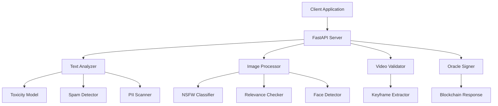

# AI Oracle Content Moderation API

A robust, AI-powered content moderation service designed for civic reporting platforms. This API validates and processes user-submitted content (text, images, videos) while maintaining privacy through automatic anonymization, and provides blockchain-verifiable signatures for approved content.

## Table of Contents
- [Overview](#overview)
- [Features](#features)
- [Prerequisites](#prerequisites)
- [Installation](#installation)
- [Configuration](#configuration)
- [Usage](#usage)
- [API Documentation](#api-documentation)
- [Architecture](#architecture)
- [Security](#security)
- [Contributing](#contributing)

## Overview

This service functions as a trusted oracle for decentralized civic reporting systems. It employs multiple AI models to ensure content quality, relevance, and safety while automatically protecting user privacy through face and license plate detection and blurring.

**Key Capabilities:**
- Multi-modal content analysis (text, images, videos)
- Privacy-preserving anonymization
- Blockchain integration with cryptographic signing
- Real-time content moderation
- GDPR-compliant PII detection and handling

## Features

### Content Moderation
- **Text Analysis**: Toxicity detection (Toxic-BERT), spam filtering, PII identification
- **Image Processing**: NSFW detection, relevance validation (CLIP), facial anonymization
- **Video Validation**: Keyframe analysis for safety and content appropriateness

### Privacy Protection
- **Face Detection**: YuNet deep learning model for accurate face detection and blurring
- **License Plate Anonymization**: OpenCV-based detection and obfuscation
- **Metadata Stripping**: Automatic removal of EXIF data including GPS coordinates
- **PII Detection**: Identifies phone numbers, emails, and national ID numbers

### Blockchain Integration
- **Oracle Functionality**: Cryptographic signing of approved content
- **Signature Verification**: Ethereum-compatible message signing and verification
- **Smart Contract Ready**: Direct integration with blockchain verification systems

## Prerequisites

- Python 3.10 or higher
- 4GB+ RAM (for AI model loading)
- 2GB+ disk space (for model storage)
- Internet connection (for initial model downloads)

## Installation

1. **Clone the repository:**
   ```bash
   git clone <repository-url>
   cd ai-moderation
   ```

2. **Create a virtual environment:**
   ```bash
   python -m venv venv
   
   # Windows
   venv\Scripts\activate
   
   # macOS/Linux
   source venv/bin/activate
   ```

3. **Install dependencies:**
   ```bash
   pip install -r requirements.txt
   ```

4. **Download required model files:**
   - Download `face_detection_yunet_2023mar.onnx` from [OpenCV Zoo](https://github.com/opencv/opencv_zoo)
   - Place in the root directory

## Configuration

1. **Create environment file:**
   ```bash
   cp .env.example .env
   ```

2. **Generate Oracle Private Key:**
   ```python
   # Run this once to generate a new private key
   from eth_account import Account
   account = Account.create()
   print(f"Private Key: {account.key.hex()}")
   print(f"Address: {account.address}")
   ```

3. **Update .env file:**
   ```env
   ORACLE_PRIVATE_KEY=your_generated_private_key_here
   ```

## Usage

### Starting the Server

```bash
# Development mode (with auto-reload)
uvicorn main:app --reload

# Production mode
uvicorn main:app --host 0.0.0.0 --port 8000
```

The API will be available at `http://localhost:8000`

### API Documentation

Interactive API documentation is available at:
- Swagger UI: `http://localhost:8000/docs`
- ReDoc: `http://localhost:8000/redoc`

## API Documentation

### Health Check
**GET** `/health`

Check service status and availability.

**Response:**
```json
{
  "status": "healthy",
  "service": "AI Oracle Content Moderation"
}
```

### Content Moderation
**POST** `/moderate`

Analyze and moderate content submissions.

**Parameters:**
- `text` (form-data, required): Text content to moderate
- `file` (form-data, optional): Image or video file to process

**Response:**
```json
{
  "decision": "APPROVE|REJECT",
  "reason": "Explanation of the decision",
  "score": 0.85,
  "signature": "0x...",
  "oracle_address": "0x...",
  "safe_image_base64": "base64_encoded_processed_image"
}
```

**Example Usage:**
```bash
# Text only
curl -X POST \
  http://localhost:8000/moderate \
  -F "text=There's a pothole on Main Street that needs fixing"

# Text with image
curl -X POST \
  http://localhost:8000/moderate \
  -F "text=Pothole report" \
  -F "file=@pothole_image.jpg"
```

**Input (Form Data):**

* `text`: (String, Required) The description of the issue.
* `image`: (File, Optional) Evidence photo.

**Response (JSON):**

```json
{
  "decision": "APPROVE",
  "reason": "Content is safe and approved by Oracle",
  "score": 0.05,
  "signature": "0x478d...",  
  "oracle_address": "0x1C93..." 
}
```

**Note:** If content is rejected (`decision: "REJECT"`), the `signature` and `oracle_address` fields will be `null`.

## Testing Examples

**Health Check:**
```bash
curl http://localhost:8000/health
```

**Moderate Text Only:**
```bash
curl -X POST "http://localhost:8000/moderate" -F "text=There is a large pothole on Main Street that needs repair"
```

**Moderate Text + Image:**
```bash
curl -X POST "http://localhost:8000/moderate" -F "text=Garbage pile near the park" -F "image=@/path/to/photo.jpg"
```

**Interactive API Documentation:** Visit `http://localhost:8000/docs` for Swagger UI.

```

## Architecture

### System Components



### AI Models Used

| Component | Model | Purpose |
|-----------|-------|---------|
| Text Toxicity | unitary/toxic-bert | Detect harmful/toxic content |
| Spam Detection | mrm8488/bert-tiny-finetuned-sms-spam-detection | Identify spam content |
| NSFW Classification | Falconsai/nsfw_image_detection | Filter inappropriate images |
| Content Relevance | openai/clip-vit-base-patch32 | Validate civic content relevance |
| Face Detection | YuNet (OpenCV) | Detect and anonymize faces |

### Processing Flow

1. **Input Validation**: Check content format and size limits
2. **Text Analysis**: Multi-layer filtering (PII, spam, toxicity)
3. **Media Processing**: Image/video analysis and anonymization
4. **Content Approval**: Final decision based on all checks
5. **Cryptographic Signing**: Generate blockchain-verifiable signature
6. **Response Generation**: Return processed content and signature

## Security

### Privacy Protection
- **Automatic Anonymization**: Faces and license plates are automatically blurred
- **Metadata Removal**: EXIF data including GPS coordinates are stripped
- **PII Detection**: Phone numbers, emails, and ID numbers are flagged

### Blockchain Security
- **Private Key Management**: Oracle keys stored in environment variables
- **Message Signing**: Ethereum-compatible EIP-191 message signing
- **Signature Verification**: Cryptographic proof of content approval

### Best Practices
- Never commit `.env` files to version control
- Rotate oracle private keys periodically
- Monitor API usage and implement rate limiting for production
- Use HTTPS in production environments

## Testing

### Running the Test Suite
```bash
# Verify signature generation and validation
python verify_test.py
```

### Manual Testing
1. Start the server: `uvicorn main:app --reload`
2. Test health endpoint: `curl http://localhost:8000/health`
3. Test moderation with sample data
4. Verify signatures using the provided test script

## Production Deployment

### Environment Setup
```bash
# Production environment variables
API_HOST=0.0.0.0
API_PORT=8000
LOG_LEVEL=WARNING
```

### Performance Considerations
- Models are loaded once at startup (expect 30-60 second initialization)
- Memory usage: ~4GB for all AI models
- Consider GPU acceleration for higher throughput
- Implement caching for repeated content

### Monitoring
- Monitor `/health` endpoint for service availability
- Track response times and error rates
- Monitor memory usage due to AI models
- Set up alerts for oracle key issues

## Troubleshooting

### Common Issues

**Models not loading:**
- Ensure sufficient RAM (4GB+)
- Check internet connection for model downloads
- Verify transformers library version

**Environment variables not found:**
- Confirm `.env` file exists and is properly formatted
- Check that `ORACLE_PRIVATE_KEY` is set without the `0x` prefix

**Face detection not working:**
- Download `face_detection_yunet_2023mar.onnx` from OpenCV Zoo
- Place the file in the project root directory

**Signature verification failing:**
- Ensure the private key matches the expected oracle address
- Verify message format matches exactly between signing and verification

## Contributing

### Development Setup
1. Fork the repository
2. Create a feature branch: `git checkout -b feature-name`
3. Install development dependencies: `pip install -r requirements-dev.txt`
4. Make your changes
5. Run tests: `python -m pytest`
6. Submit a pull request

### Code Style
- Follow PEP 8 guidelines
- Use type hints where possible
- Add docstrings for all public functions
- Include error handling for external API calls

### Adding New Models
When integrating new AI models:
1. Add model loading to the initialization section
2. Implement proper error handling
3. Update memory requirements in documentation
4. Add corresponding tests

## License

This project is licensed under the MIT License - see the [LICENSE](LICENSE) file for details.

## Support

For questions or support:
- Create an issue in the GitHub repository
- Check the troubleshooting section above
- Review the interactive API documentation at `/docs`

## Changelog

### v1.0.0 (Current)
- Initial release with multi-modal content moderation
- Blockchain oracle integration
- Privacy-preserving anonymization
- Comprehensive API documentation

