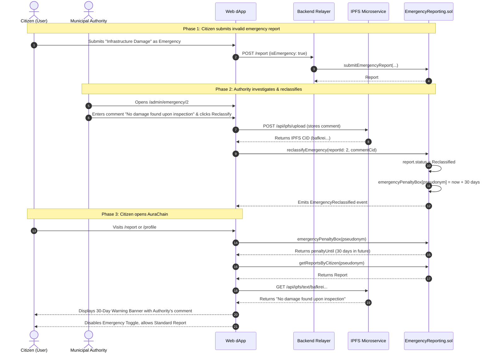

# AuraChain: Emergency Reporting & 30-Day Penalty Safeguard System

## Table of Contents
1. [Executive Summary & System Philosophy](#1-executive-summary--system-philosophy)
2. [Why the Penalty Box Exists: Game Theory & Attack Mitigation](#2-why-the-penalty-box-exists-game-theory--attack-mitigation)
3. [Cryptographic Privacy & Anonymous Accountability](#3-cryptographic-privacy--anonymous-accountability)
4. [System Architecture & Component Stack](#4-system-architecture--component-stack)
5. [Smart Contract Mechanics (`EmergencyReporting.sol`)](#5-smart-contract-mechanics-emergencyreportingsol)
6. [Backend Relayer Safeguards & Error Processing](#6-backend-relayer-safeguards--error-processing)
7. [Citizen Experience & UI/UX Design System](#7-citizen-experience--uiux-design-system)
8. [End-to-End Operational Workflows](#8-end-to-end-operational-workflows)
9. [API & Interface Reference](#9-api--interface-reference)
10. [Testing & Verification Guide](#10-testing--verification-guide)

---

## 1. Executive Summary & System Philosophy

**AuraChain** provides local municipal governance with two distinct tiers of citizen civic reporting:

1. **Standard Civic Reporting**:  
   Non-urgent issues (potholes, garbage accumulation, street lighting, public park maintenance). These reports enter a decentralized **48-hour community triage phase** where verified neighborhood citizens upvote, downvote, and validate issues before municipal allocation.

2. **Emergency Fast-Track Reporting**:  
   Critical, time-sensitive hazards (major water main bursts, bridge collapse risks, gas leaks, imminent structural failures, downed live electrical wires). These alerts **completely bypass the 48-hour community voting phase** and are dispatched directly to local municipal authorities and emergency response command dashboards in real-time.

```
┌───────────────────────────────────────────────────────────────────────────┐
│                           CITIZEN REPORT INTAKE                           │
└─────────────────────┬───────────────────────────────┬─────────────────────┘
                      │                               │
            [ Standard Civic Report ]       [ Urgent Emergency Report ]
                      │                               │
                      ▼                               ▼
         ┌─────────────────────────┐     ┌─────────────────────────┐
         │ 48h Community Voting    │     │ Bypass Community Vote   │
         │ & Neighbor Validation   │     │ Instant Authority Alert │
         └────────────┬────────────┘     └────────────┬────────────┘
                      │                               │
                      ▼                               ▼
         ┌─────────────────────────┐     ┌─────────────────────────┐
         │ Scheduled Municipal     │     │ Immediate Emergency     │
         │ Public Works Dispatch   │     │ Dispatch & Inspection   │
         └─────────────────────────┘     └─────────────────────────┘
```

Because emergency reports command urgent public resources and immediate authority attention, the system must prevent **false alarms, prank submissions, panic-inducing hoaxes, and griefing attacks** that could saturate municipal response teams.

To solve this without compromising citizen privacy, AuraChain implements an automated, on-chain **30-Day Emergency Penalty Box**.

---

## 2. Why the Penalty Box Exists: Game Theory & Attack Mitigation

### The Free-Rider & False Alarm Dilemma
In a zero-gas, privacy-preserving governance platform, submitting a report costs the citizen no native gas tokens (relayer pays transaction fees via Zero-Knowledge proof authentication). Without an anti-abuse mechanism:
- Dishonest actors or careless users could mark ordinary complaints (e.g. minor litter) as "Emergency" to leapfrog the community queue.
- Emergency dispatches could be sent to non-existent incidents, wasting civic funds and endangering citizens who have real emergencies elsewhere.

### The Penalty Box Mechanism
When a municipal authority or super-admin inspects an emergency report and determines that:
- The incident was fabricated, completely exaggerated, or a non-emergency,
- The authority triggers the on-chain **`reclassifyEmergency`** function accompanied by an obligatory public IPFS explanation comment.

The smart contract immediately restricts that citizen's pseudonym from submitting emergency reports for **30 calendar days** (`block.timestamp + 30 days`).

```
                    MUNICIPAL AUTHORITY REVIEW
                                │
             Does the report describe a real emergency?
                                │
               ┌────────────────┴────────────────┐
               │ YES                             │ NO
               ▼                                 ▼
      [ Mark Resolved ]               [ Reclassify as False Alarm ]
               │                                 │
     Issue resolved on-chain           • Report status → Reclassified
     Citizen in Good Standing          • On-chain 30-Day Penalty Lock
                                       • Authority reason uploaded to IPFS
                                       • Emergency toggle disabled for citizen
                                       • Standard civic reporting REMAINS ACTIVE
```

### Proportional & Restorative Justice
Crucially, the penalty is **strictly scoped to emergency fast-tracking**:
- **What is blocked**: The ability to submit emergency fast-track reports.
- **What remains fully active**: Standard civic reporting, community verification voting, opinion polling, and comment threads. The citizen is **not banned** from governance; they are merely required to route future submissions through standard community triage for 30 days.

---

## 3. Cryptographic Privacy & Anonymous Accountability

AuraChain balances citizen privacy with anti-abuse accountability through deterministic, salted pseudonyms:

### Pseudonym Derivation
Neither the municipal authority nor the smart contract ever stores the citizen’s national identity (NIC), name, or cleartext wallet address. Instead, the relayer and client derive an isolated pseudonym:

$$\text{citizenPseudonym} = \text{keccak256}\Big(\text{solidityPacked}\big([\text{"address"}, \text{"string"}], [\text{citizenPubKey}, \text{"CivicReport-v1"}]\big)\Big)$$

- **Domain Separation Salt**: `"CivicReport-v1"` ensures this hash cannot be correlated with other identity domains or external dApps.
- **Authority Visibility**: The authority only sees `reportId` and `bytes32 citizenPseudonym`.
- **Zero-Knowledge Decoupling**: The ZKP simulator issues single-use tickets that authenticate civic rights without linking real-world GovID to the wallet address.

When the penalty is applied, `emergencyPenaltyBox[citizenPseudonym] = block.timestamp + 30 days` locks only that pseudonym's emergency privileges.

---

## 4. System Architecture & Component Stack

```
┌─────────────────────────────────────────────────────────────────────────────┐
│                           WEB-DAPP (Next.js 14)                             │
│                                                                             │
│  useEmergencyPenalty Hook                                                  │
│   ├── Reads emergencyPenaltyBox(pseudonym) from RPC                         │
│   ├── Fetches citizen reports & detects Reclassified status                │
│   └── Resolves authority reason text from IPFS                             │
│                                                                             │
│  UI Components with Penalty Awareness:                                      │
│   ├── /report: Banner, disabled toggle, submit prevention                   │
│   ├── NotificationBell: Persistent alert & 'Penalty Blocked' card           │
│   ├── /my-reports: Dual-query (Civic + Emergency) & reclassification reason │
│   ├── /profile: 'Emergency Fast-Track Standing' indicator                   │
│   └── /emergency: Hero alert banner & locked CTA state                     │
└──────────────────────────────┬──────────────────────────────────────────────┘
                               │
            ┌──────────────────┴──────────────────┐
            ▼                                     ▼
┌───────────────────────────────┐     ┌───────────────────────────────────────┐
│   BACKEND-RELAYER (NestJS)    │     │          IPFS CLUSTER / API           │
│                               │     │                                       │
│  • Pre-check penalty box on   │     │  • Authority reclassification comment │
│    emergency submit           │     │    stored as text CID                 │
│  • Throw 403 Forbidden early  │     │  • /api/ipfs/text/:cid endpoint       │
│  • Catch EmergencyReporting-  │     │  • Permanent decentralized audit      │
│    Locked and emit penalty msg│     │    trail of authority actions         │
│  • GET /report/penalty-status │     └───────────────────────────────────────┘
└───────────────┬───────────────┘
                │
                ▼
┌─────────────────────────────────────────────────────────────────────────────┐
│               PRIVATE BESU / GETH BLOCKCHAIN (PoA Network)                  │
│                                                                             │
│  EmergencyReporting.sol (0x43491d6850cef4B2E2D0d5CaCdF59B014B4A49ba)        │
│   ├── mapping(bytes32 => uint256) public emergencyPenaltyBox                │
│   ├── submitEmergencyReport(...) checks penalty box                         │
│   ├── reclassifyEmergency(reportId, comment) sets 30-day penalty            │
│   └── getReportsByCitizen(pseudonym, offset, limit)                         │
└─────────────────────────────────────────────────────────────────────────────┘
```

---

## 5. Smart Contract Mechanics (`EmergencyReporting.sol`)

### Contract Storage & State
```solidity
enum EmergencyStatus { Open, InProgress, Resolved, Reclassified }

struct EmergencyReport {
    uint256 id;
    string ipfsCid;
    bytes32 reportHash;
    bytes32 submissionNullifier;
    bytes32 citizenPseudonym;
    address submittedByRelayer;
    EmergencyStatus status;
    uint256 createdAt;
    uint256 updatedAt;
    address assignedAuthority;
    string authorityComment;      // IPFS CID of authority explanation
    string authorityImageCid;     // Optional proof photo CID
    bool isReclassified;
}

// Pseudonym => Unix timestamp until which emergency reporting is locked
mapping(bytes32 => uint256) public emergencyPenaltyBox;
```

### Emergency Report Submission Guard
When a citizen attempts to submit an emergency report:
```solidity
function submitEmergencyReport(
    string calldata ipfsCid,
    bytes32 reportHash,
    bytes32 submissionNullifier,
    bytes32 citizenPseudonym
) external onlyRelayer nonReentrant returns (uint256) {
    // Check if citizen pseudonym is currently in the penalty box
    if (block.timestamp <= emergencyPenaltyBox[citizenPseudonym]) {
        revert EmergencyReportingLocked();
    }
    ...
}
```
If the current timestamp is less than or equal to `emergencyPenaltyBox[citizenPseudonym]`, the contract reverts with custom error `EmergencyReportingLocked()` (selector `0x0cc4f7a8`).

### Reclassification & Penalty Assignment
When an authority finds an emergency report invalid:
```solidity
function reclassifyEmergency(
    uint256 reportId,
    string calldata comment
) external onlyAuthorityOrRelayer nonReentrant {
    EmergencyReport storage report = reports[reportId];
    if (reportId == 0 || reportId > reportCount) revert InvalidReportId();
    if (report.status != EmergencyStatus.Open && report.status != EmergencyStatus.InProgress)
        revert InvalidState();

    report.status = EmergencyStatus.Reclassified;
    report.isReclassified = true;
    report.updatedAt = block.timestamp;
    report.authorityComment = comment;

    // Apply 30-day cryptographic penalty box
    uint256 penaltyUntil = block.timestamp + 30 days;
    emergencyPenaltyBox[report.citizenPseudonym] = penaltyUntil;

    emit EmergencyReclassified(reportId, msg.sender, comment, penaltyUntil, block.timestamp);
}
```

---

## 6. Backend Relayer Safeguards & Error Processing

### 1. Pre-Flight HTTP Validation (`reporting.service.ts`)
Instead of allowing a penalized citizen to consume a single-use ZKP ticket or enqueue a background job that is guaranteed to revert on-chain, the relayer validates the penalty status upon receiving `POST /report`:

```typescript
const isEmergencyBool = isEmergency === 'true' || isEmergency === true;
if (isEmergencyBool) {
  const penaltyUntil = await this.blockchainService.getEmergencyPenaltyBox(citizenPseudonym);
  const now = BigInt(Math.floor(Date.now() / 1000));
  if (penaltyUntil > now) {
    const unlockDate = new Date(Number(penaltyUntil) * 1000).toLocaleString();
    throw new ForbiddenException(
      `Emergency reporting suspended until ${unlockDate} because a previous emergency alert was reclassified as non-emergency. Please submit as a standard civic report.`
    );
  }
}
```

### 2. Immediate Failure Without Useless Retries (`report-queue.processor.ts`)
Standard blockchain transactions that fail due to transient network congestion or nonce desynchronization are retried up to 3 times with exponential backoff (2s, 8s, 32s).

However, an `EmergencyReportingLocked` failure will never succeed by retrying. The BullMQ worker checks for `EMERGENCY_REPORTING_LOCKED` and immediately breaks out of the retry loop:

```typescript
// In withRetry helper
if (err?.message?.includes('EMERGENCY_REPORTING_LOCKED')) {
  break; // Do not retry on penalty lock
}

// In processor catch block
const isPenalty = err?.message?.includes('EMERGENCY_REPORTING_LOCKED') ||
                  err?.message?.includes('EmergencyReportingLocked');

const userMessage = isPenalty
  ? 'Emergency reporting blocked: Account is currently in a 30-day penalty box for false emergency reporting.'
  : 'Failed to submit to blockchain after 3 retries.';

await emit('blockchain_failed', 90, userMessage, { error: err.message, isPenalty: Boolean(isPenalty) });
```

### 3. Authenticated Status Endpoint (`reporting.controller.ts`)
Citizens can query their real-time penalty status via:
`GET /report/penalty-status` (authenticated via citizen wallet signature).

---

## 7. Citizen Experience & UI/UX Design System

To ensure citizens are never confused or blind-sided, five key areas of the frontend provide proactive visibility:

### 1. Dedicated React Hook: `useEmergencyPenalty`
Located at [web-dapp/lib/useEmergencyPenalty.ts](file:///d:/Projects/git/local-governance/web-dapp/lib/useEmergencyPenalty.ts).
- Automatically derives pseudonym on login.
- Queries `emergencyPenaltyBox` on `EmergencyReporting.sol`.
- Checks the citizen's reports to locate the specific reclassified report ID.
- Downloads the authority's comment text directly from IPFS so the citizen understands the reason.
- Returns `{ isPenalized, penaltyUntil, penaltyUntilDate, daysRemaining, reason, reclassifiedReportId, loading, refresh }`.

### 2. Report Submission Screen (`/report`)
- **Penalty Active State**:
  - Displays a high-contrast amber alert card:
    - **Header**: "Emergency Reporting Suspended (30-Day Penalty Active — `X` days left)"
    - **Notice**: Exact date & time when privileges will be restored.
    - **Authority Feedback**: Quotes the exact comment written by the authority.
    - **Reassurance**: *"Standard civic reporting is unaffected. You can submit this report as a normal community issue."*
  - The "Urgent / Emergency" toggle switch is replaced with the warning card so the user cannot toggle emergency.
  - Form validation prevents submitting with `isEmergency: true`.

### 3. Notification Bell & Submissions Drawer (`NotificationBell.tsx`)
- **Persistent Header Banner**: When opening the Submissions drawer, penalized citizens see an amber alert card with remaining days and authority comment.
- **Clean Failure Cards**: If an emergency submission fails due to penalty, it displays:
  - **Badge**: `Penalty Blocked` (amber with `AlertTriangle` icon).
  - **Text**: *"Emergency submission rejected by network safeguard. Your ID is in a 30-day penalty lock for a previous false alarm. Standard community reports remain available."*

### 4. My Reports Portal (`/my-reports`)
- Dual queries standard reports (`Reporting.sol`) and emergency reports (`EmergencyReporting.sol`).
- Reports with status `Reclassified` display:
  - Badge: `Reclassified (False Alarm)`
  - Authority notice box: `Notice: "Searched and verified that no such infrastructure damage occurred."`
  - Explanatory note: *"30-day emergency reporting restriction applied."*
- Persistent top banner showing remaining penalty days.

### 5. Profile Dashboard (`/profile`) & Emergency Portal (`/emergency`)
- **Profile**: Under Civic Identity & Security, shows **Emergency Fast-Track Standing**:
  - Unrestricted: `● Good` (Green)
  - Restricted: `⚠️ Restricted (X days left)` (Amber) with full authority reason banner.
- **Emergency Hub**: Displays banner informing the citizen that emergency access is restricted, adjusting the CTA to `"Emergency Submissions Locked (File Standard Report)"`.

---

## 8. End-to-End Operational Workflows

### Sequence: False Alarm Reclassification & Citizen Awareness



---

## 9. API & Interface Reference

### Smart Contract Methods (`EmergencyReporting.sol`)

| Function | Visibility | Access | Description |
|---|---|---|---|
| `emergencyPenaltyBox(bytes32)` | `external view` | Public | Returns Unix timestamp until which emergency reporting is locked for pseudonym. |
| `reclassifyEmergency(uint256 reportId, string comment)` | `external` | Authority / Relayer | Marks report as reclassified and sets `emergencyPenaltyBox` to `block.timestamp + 30 days`. |
| `submitEmergencyReport(...)` | `external` | Relayer | Reverts with `EmergencyReportingLocked()` if citizen is in penalty box. |
| `getReportsByCitizen(bytes32 pseudonym, uint256 offset, uint256 limit)` | `external view` | Public | Returns paginated list of emergency reports submitted by the citizen pseudonym. |

### Backend Relayer Endpoints

#### 1. Submit Report
- **URL**: `POST /report`
- **Headers**: `Content-Type: multipart/form-data`
- **Behavior**: If `isEmergency === true` and citizen is in penalty box, returns:
  ```json
  {
    "statusCode": 403,
    "error": "Forbidden",
    "message": "Emergency reporting suspended until 10/3/2026, 8:22:36 PM because a previous emergency alert was reclassified as non-emergency. Please submit as a standard civic report."
  }
  ```

#### 2. Get Penalty Status
- **URL**: `GET /report/penalty-status`
- **Headers**: `Authorization: <walletAddress>:<timestamp>:<signature>`
- **Response**:
  ```json
  {
    "isPenalized": true,
    "penaltyUntil": 1791039156,
    "penaltyDate": "2026-10-03T14:52:36.000Z",
    "pseudonym": "0x950849b16cbc7194fca65964a075668e64e96640124a333fd00951a6c019cb79"
  }
  ```

---

## 10. Testing & Verification Guide

### 1. Verifying Penalty Status via CLI
To query the on-chain penalty timestamp for any pseudonym directly using `ethers.js`:

```javascript
const { ethers } = require('ethers');
const provider = new ethers.JsonRpcProvider('https://rpc.internalbuildtools.online');
const abi = ['function emergencyPenaltyBox(bytes32) view returns (uint256)'];
const contract = new ethers.Contract('0x43491d6850cef4B2E2D0d5CaCdF59B014B4A49ba', abi, provider);

async function checkPenalty(pseudonym) {
  const penaltyUntil = await contract.emergencyPenaltyBox(pseudonym);
  console.log('Penalty Timestamp:', penaltyUntil.toString());
  if (penaltyUntil > 0n) {
    console.log('Expires on:', new Date(Number(penaltyUntil) * 1000).toLocaleString());
  } else {
    console.log('Citizen in good standing.');
  }
}
```

### 2. Manual End-to-End Test Procedure
1. **Submit Emergency Report**:
   - Log into `web-dapp` as a verified citizen (e.g., Kamal Perera).
   - Go to `/report`, toggle **Urgent / Emergency Report**, submit a test report.
2. **Admin Reclassification**:
   - Log into `/admin` as Super Admin or Municipal Authority.
   - Navigate to `/admin/emergency` and select the report.
   - Click **Reclassify as Non-Emergency**, enter an authority comment, and confirm.
3. **Verify Citizen Experience**:
   - Switch back to citizen account.
   - Open **Submissions Drawer** (Notification Bell) $\rightarrow$ observe persistent amber notice with remaining days.
   - Open `/report` $\rightarrow$ observe the emergency toggle is locked and the amber banner displays the authority's comment.
   - Submit a standard civic report $\rightarrow$ confirm standard civic submission succeeds without error.
   - Open `/profile` $\rightarrow$ verify **Emergency Fast-Track Standing** displays `⚠️ Restricted`.
